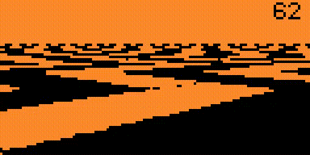

# Flipper Zero Mode 7 Demo

A simple proof-of-concept of pseudo 3D rendering, modelled after a famous Mode 7 from SNES.

## Controls
* **Up/Down/Left/Right** - Move the camera
* **OK** - Rotate the camera
* **Back (press)** - Switch backgrounds
* **Back (hold)** - Exit

## Custom assets
The demo accepts two custom assets, optionally placed on the SD card:
* `/mode7_demo/background.pbm` - a custom background that can be selected by short pressing **Back** 3 times. Must be saved as a Raw PBM, text-based PBM files are not supported.
* `/mode7_demo/scales.txt` - a text file that should consist of two numbers specifying the background scaling (`16 16`). Higher values "zoom out" the camera.

## Known issues and limitations
* **Please don't use this demo as an example of a Flipper Zero app lifecycle.** Literally nothing about this app's initialization, teardown or logic is done "by the book". A proper application should stick to using Views or Scenes.
* No effort was put into optimizing the maths behind the perspective projection and the code has not been profiled. The cost of those calculations could probably be reduced significantly by interpolating the intermediate values within a scanline.
  Floating-point math could also be replaced with fixed-point math, potentially improving performance further.
* Mirrored screen in qFlipper is very laggy. This does not happen on the device.
