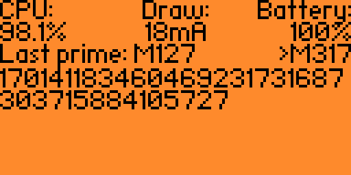

# Flipper95

Application to stress test the Flipper by finding Mersenne primes using the Lucas-Lehmer Test,
much like Prime95 does.

## Usage

By default, the app starts from the Mersenne prime `M2`. This can be overridden from the CLI,
and the application may be instructed to advance to testing a higher Mersenne number
for primality.

The following commands are added to `ufbt cli`:
* `flipper95 advance Mx` -- advance calculations to Mersenne number `Mx`, where `x` is a positive number.
* `flipper95 prime` -- print the last found Mersenne prime.
* `flipper95 perfect_number` -- print a perfect number corresponding to the last found Mersenne prime. This number is calculated on demand, so this command might take a very long time!
